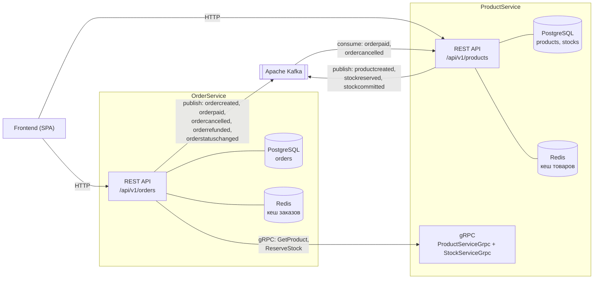
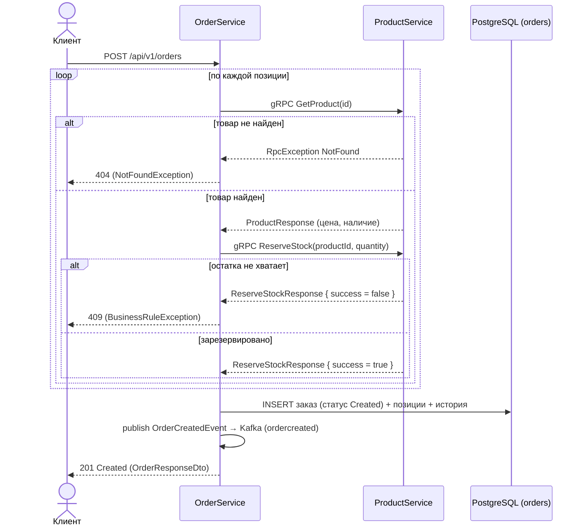
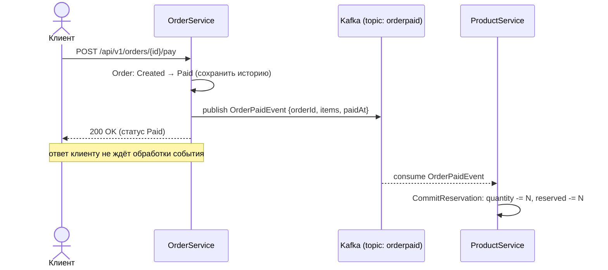
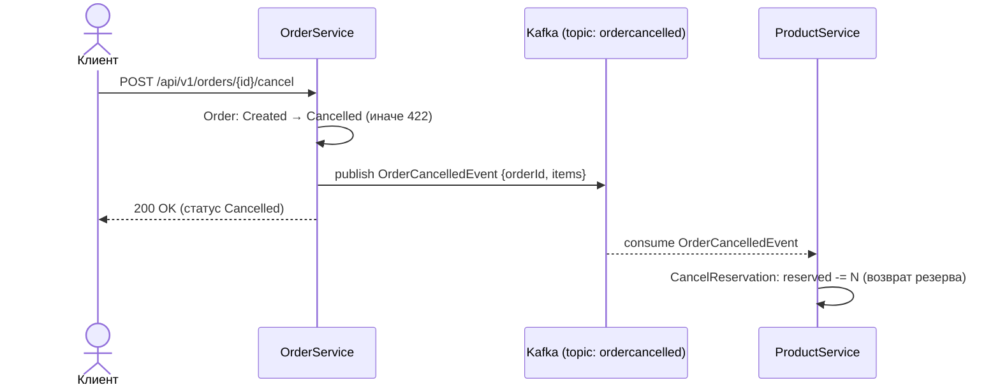

# OrderService — Система заказов (Маркетплейс)

Микросервис системы заказов учебного проекта «Маркетплейс». Отвечает за оформление
заказов, их обработку и изменение статусов с сохранением полной истории. Является
частью микросервисной архитектуры и взаимодействует с системой продуктов
(**ProductService**) синхронно через gRPC и асинхронно через Kafka.
С фронтендом сервис общается по HTTP (REST).

## Технологический стек

| Категория            | Технология                                   |
|----------------------|----------------------------------------------|
| Платформа            | .NET 9 / ASP.NET Core (REST для фронта)      |
| База данных          | PostgreSQL                                   |
| Доступ к данным      | Dapper (чистый SQL, без ORM)                 |
| Миграции             | FluentMigrator                               |
| Валидация            | FluentValidation                             |
| Межсервисный sync    | gRPC (Grpc.Net.ClientFactory)                |
| Кеширование          | Redis + in-memory (двухуровневый кеш)        |
| Брокер сообщений     | Apache Kafka (Confluent.Kafka)               |
| Маппинг              | AutoMapper                                   |
| Тесты                | xUnit, Moq, FluentAssertions, Testcontainers |
| Контейнеризация      | Docker, docker-compose                       |

## Архитектура (Clean Architecture, 4 слоя)

```
OrderService.Domain          // Сущности, value objects, стейт-машина заказа, интерфейсы
OrderService.Application     // Use cases, DTO, абстракции, события, валидаторы, маппинг
OrderService.Infrastructure  // Dapper-репозитории, миграции, Redis, Kafka, gRPC-клиент
OrderService.Presentation    // REST-контроллеры, обработка ошибок, DI, точка входа
OrderService.Tests           // Unit + интеграционные тесты
```

Зависимости направлены внутрь: `Presentation → Application → Domain`,
`Infrastructure → Application/Domain`. Внешние зависимости описаны абстракциями
в `Application/Abstractions` (`IEventPublisher`, `IOrderCache`,
`IProductCatalogClient`) и `Domain/Interfaces` (`IOrderRepository`).

Сценарии работы с заказами разнесены по SRP на три сфокусированных сервиса,
у каждого — свой контроллер:
- `IOrderCreationService` / `OrderCreationService` — оформление заказа (резерв, расчёт суммы);
- `IOrderQueryService` / `OrderQueryService` — чтение (по id с кешем, список, история);
- `IOrderLifecycleService` / `OrderLifecycleService` — переходы статусов и возврат денег.

Конфигурация выполняется в `Startup` (`ConfigureServices`/`Configure`), а `Program.cs`
собирает хост через `Host.CreateDefaultBuilder().UseStartup<Startup>()` и применяет
миграции расширением `RunMigrations()`. Каждый слой предоставляет DI-расширение
(`AddApplication`, `AddInfrastructure`), которые вызываются из `Startup`. Ошибки
перехватываются `ExceptionHandlingMiddleware` и возвращаются единым JSON-форматом.

## Жизненный цикл заказа (стейт-машина)

```
Created ──▶ Paid ──▶ Assembling ──▶ Shipped ──▶ Delivered ──▶ Received
   │                                                │
   │                                                └────────▶ Returned
   │
   └──▶ Cancelled
```

- **Отмена** (`Cancelled`) возможна **только до оплаты** — из статуса `Created`.
  После оплаты товар списывается со склада, поэтому отмена запрещена.
- После доставки в ПВЗ заказ завершается одним из двух финальных статусов:
  `Received` (получатель забрал) или `Returned` (произведён возврат → **возврат денег**).
- Финальные статусы: `Received`, `Returned`, `Cancelled` — дальнейшие переходы запрещены.

Все переходы валидируются стейт-машиной агрегата `Order` (строго по порядку, без
«перепрыгивания») и фиксируются в таблице `order_status_history`.

## REST API

| Метод | Маршрут                              | Описание                                |
|-------|--------------------------------------|-----------------------------------------|
| POST  | `/api/v1/orders`                     | Оформить заказ (проверка и резерв товара)|
| GET   | `/api/v1/orders`                     | Список заказов (фильтр, пагинация)      |
| GET   | `/api/v1/orders/{id}`                | Заказ по id (с кешем)                   |
| GET   | `/api/v1/orders/{id}/history`        | История статусов заказа                 |
| POST  | `/api/v1/orders/{id}/pay`            | Оплата (симуляция): Created → `Paid`    |
| POST  | `/api/v1/orders/{id}/assemble`       | В сборку: Paid → `Assembling`           |
| POST  | `/api/v1/orders/{id}/ship`           | В доставку: Assembling → `Shipped`      |
| POST  | `/api/v1/orders/{id}/deliver`        | Доставлен в ПВЗ: Shipped → `Delivered`  |
| POST  | `/api/v1/orders/{id}/receive`        | Получен: Delivered → `Received`         |
| POST  | `/api/v1/orders/{id}/return`         | Возврат: Delivered → `Returned` (+возврат денег)|
| POST  | `/api/v1/orders/{id}/cancel`         | Отмена (только до оплаты) → `Cancelled` (+возврат резерва)|
| POST  | `/api/v1/orders/{id}/status`         | Произвольный переход статуса            |

Контроллеры разнесены по зонам ответственности: `OrdersCreationController`,
`OrdersQueryController`, `OrdersLifecycleController` (общий маршрут `api/v1/orders`).

### Поле `currency`

Валюта необязательна — при отсутствии применяется значение по умолчанию `RUB`.
Допустимые значения проверяются на уровне валидации (`CreateOrderValidator`):
поддерживаются `RUB` и `USD`. Цена позиций берётся из ProductService, а не от клиента.

## Интеграция с ProductService

**Синхронно (gRPC, исходящие вызовы).** ProductService предоставляет два gRPC-сервиса,
их контракты зеркалируются у нас в `Infrastructure/Protos`:
- `product.ProductServiceGrpc` → `GetProduct(id)` — актуальная цена и наличие товара;
- `stock.StockServiceGrpc` → `ReserveStock(product_id, quantity)` — резерв товара при оформлении.

> gRPC работает поверх HTTP/2. ProductService слушает gRPC на отдельном порту
> (HTTP/2), REST для фронта — на другом (HTTP/1.1). Адрес gRPC задаётся настройкой
> `ProductCatalog:GrpcAddress` (на сервере — `http://product-service-api:5002`).
> Отсутствие товара клиент распознаёт по gRPC-статусу `NotFound` (и `Unknown/Internal`
> с признаком «not found») и возвращает наружу корректный `404`.

**Асинхронно (Kafka, публикуемые события).** Имя топика = имя типа события без
суффикса `Event` в нижнем регистре, тело — JSON в camelCase (контракт совпадает
с консьюмерами ProductService):
- `ordercreated` — заказ создан;
- `orderpaid` — заказ оплачен (**ProductService слушает и списывает резерв**);
- `ordercancelled` — заказ отменён (**ProductService слушает и возвращает резерв на склад**);
- `orderrefunded` — произведён возврат денег (возврат доставленного заказа);
- `orderstatuschanged` — изменение статуса заказа.

ProductService содержит консьюмеры `OrderPaidEventHandler` (списание резерва) и
`OrderCancelledEventHandler` (возврат резерва), поэтому обе цепочки замыкаются
end-to-end.

## Диаграммы взаимодействия микросервисов

### Общая схема (контекст)

Два канала связи: **синхронный** (gRPC, запрос-ответ) для проверки и резерва
товара и **асинхронный** (Kafka, события) для уведомлений о фактах.



### Сценарий 1. Оформление заказа (синхронно, gRPC)

При создании заказа требуется немедленный ответ: есть ли товар и удалось ли
зарезервировать остаток. Цена берётся из каталога, а не от клиента.



### Сценарий 2. Оплата заказа (асинхронно, Kafka)

Оплата — свершившийся факт, мгновенный ответ от склада не нужен. OrderService
фиксирует статус и публикует событие; ProductService списывает резерв со склада.



### Сценарий 3. Отмена заказа (асинхронно, Kafka)

Отмена возможна только до оплаты (товар ещё не списан), поэтому возврата денег
не требуется — только возврат зарезервированного товара на склад.



### Распределение ответственности

| Действие         | Канал                          | Эффект на складе                        |
|------------------|--------------------------------|-----------------------------------------|
| Создание заказа  | gRPC (sync)                    | `reserved += N` (резерв)                |
| Оплата заказа    | Kafka `orderpaid` (async)      | `quantity -= N, reserved -= N` (списание)|
| Отмена заказа    | Kafka `ordercancelled` (async) | `reserved -= N` (возврат резерва)       |

## Схема БД

- `orders` — заказ (статус, валюта, данные покупателя, сумма, аудит-метки);
- `order_items` — позиции заказа (товар, цена на момент покупки, количество);
- `order_status_history` — неизменяемая история переходов статусов.

## Запуск

### Локальный стенд (оба сервиса)

`docker-compose.local.yml` поднимает общую инфраструктуру и оба микросервиса
(локальная gRPC-версия ProductService + OrderService) в одной сети:

```bash
docker compose -f docker-compose.local.yml up -d --build
```

### Серверный стек

`docker-compose.remote.yaml` — стек для сервера: оба API, фронтенд, две БД
(`product-postgres`, `order-postgres`), Redis, Kafka (+ Kafka UI) и init-контейнер
`kafka-init`, который заранее создаёт нужные топики. Учётные данные PostgreSQL
вынесены в `.env` (см. `.env.example`) — единый источник для БД и строк подключения:

```bash
cp .env.example .env   # при необходимости поменять пароль
docker compose -f docker-compose.remote.yaml up -d
```

> Kafka и Zookeeper используют постоянные volume, поэтому топики и сообщения
> переживают перезапуск стека. БД также на постоянных volume; при смене
> `POSTGRES_PASSWORD` на уже существующем томе требуется однократное пересоздание
> тома (иначе Postgres вернёт `28P01: password authentication failed`).

### Локально (только OrderService)

```bash
# Поднять инфраструктуру (postgres/redis/kafka), затем:
dotnet run --project OrderService.Presentation
```

Конфигурация — в `appsettings.json` / `appsettings.Development.json`: строки
подключения PostgreSQL и Redis, настройки Kafka, gRPC-адрес ProductService
(`ProductCatalog:GrpcAddress`) и список разрешённых CORS-origin'ов
(`Cors:AllowedOrigins`). Миграции применяются автоматически при старте приложения.

## Тесты

```bash
dotnet test
```

- **Unit** (`OrderService.Tests/Unit`): стейт-машина заказа, value objects
  (`Money`, `CustomerInfo`, `OrderItem`) и сценарии прикладного слоя
  (`OrderCreationService`, `OrderQueryService`, `OrderLifecycleService`) на моках.
- **Integration** (`OrderService.Tests/Integration`): `OrderRepository` на
  реальном PostgreSQL через Testcontainers с применением миграций FluentMigrator.
  > Для запуска интеграционных тестов требуется установленный и запущенный Docker.

### Покрытие кода

Сбор покрытия выполняется через `coverlet.collector` в формате Cobertura:

```bash
# Только юнит-тесты (без Docker), с отчётом покрытия в ./coverage:
dotnet test --filter "FullyQualifiedName~Unit" \
  --collect:"XPlat Code Coverage" --results-directory ./coverage
```

Итоговый файл: `coverage/<guid>/coverage.cobertura.xml`. Для читаемого HTML-отчёта
можно использовать ReportGenerator:

```bash
dotnet tool install -g dotnet-reportgenerator-globaltool
reportgenerator -reports:./coverage/**/coverage.cobertura.xml \
  -targetdir:./coverage/report -reporttypes:Html
```

Текущее покрытие (юнит-прогон): слой **Application — ~95%** строк,
**Domain — ~84%** строк. Слой Infrastructure (`OrderRepository`) покрывается
интеграционными тестами (требуют Docker). Автогенерируемый gRPC-код,
DTO/события и DI-регистрация в метрике не учитываются как значимые.

---
