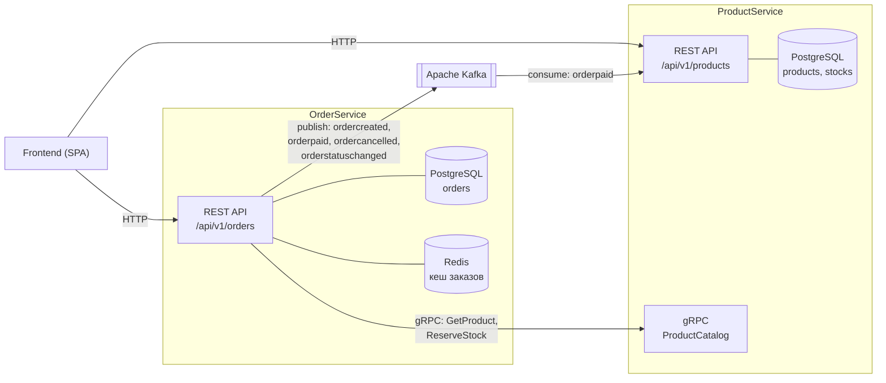
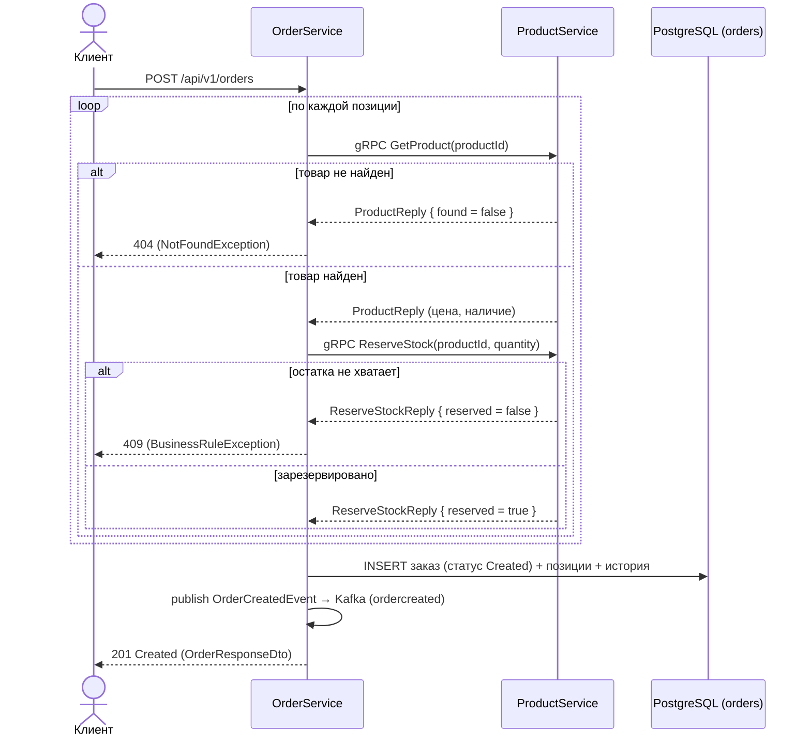
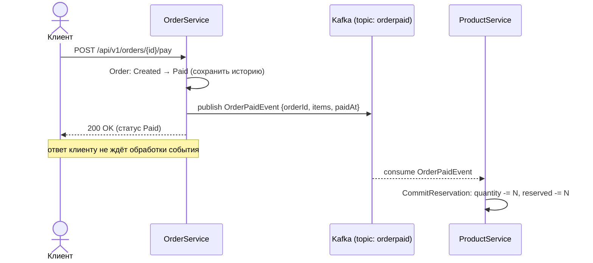
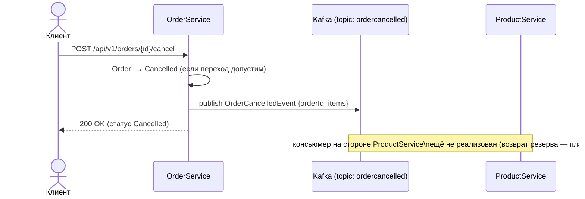

# OrderService — Система заказов (Маркетплейс)

Микросервис системы заказов учебного проекта «Маркетплейс». Отвечает за оформление
заказов, их обработку и изменение статусов с сохранением полной истории. Является
частью микросервисной архитектуры и взаимодействует с системой продуктов
(**ProductService**) синхронно через gRPC и асинхронно через Kafka.
С фронтендом сервис общается по HTTP (REST).

## Технологический стек

| Категория            | Технология                                   |
|----------------------|----------------------------------------------|
| Платформа            | .NET 9 / ASP.NET Core (REST для фронта)         |
| База данных          | PostgreSQL                                   |
| Доступ к данным      | Dapper (чистый SQL, без ORM)                 |
| Миграции             | FluentMigrator                               |
| Валидация            | FluentValidation                             |
| Межсервисный sync    | gRPC (Grpc.Net.Client / Grpc.AspNetCore)     |
| Кеширование          | Redis + in-memory (двухуровневый кеш)        |
| Брокер сообщений     | Apache Kafka (Confluent.Kafka)               |
| Маппинг              | AutoMapper                                   |
| Тесты                | xUnit, Moq, FluentAssertions, Testcontainers |
| Контейнеризация      | Docker, docker-compose                       |

## Архитектура (Clean Architecture, 4 слоя)

```
OrderService.Domain          // Сущности, value objects, стейт-машина заказа, интерфейсы
OrderService.Application     // Use cases, DTO, абстракции, события, валидаторы, маппинг
OrderService.Infrastructure  // Dapper-репозитории, миграции, Redis, Kafka, gRPC-клиент
OrderService.Presentation    // REST-контроллеры, обработка ошибок, DI, точка входа
OrderService.Tests           // Unit + интеграционные тесты
```

Зависимости направлены внутрь: `Presentation → Application → Domain`,
`Infrastructure → Application/Domain`. Внешние зависимости описаны абстракциями
в `Application/Abstractions` (`IEventPublisher`, `IOrderCache`,
`IProductCatalogClient`) и `Domain/Interfaces` (`IOrderRepository`).

Сценарии работы с заказами разнесены по SRP на три сфокусированных сервиса:
- `IOrderCreationService` / `OrderCreationService` — оформление заказа (резерв, расчёт суммы);
- `IOrderQueryService` / `OrderQueryService` — чтение (по id с кешем, список, история);
- `IOrderLifecycleService` / `OrderLifecycleService` — переходы статусов и возврат денег.

Конфигурация выполняется в `Startup` (`ConfigureServices`/`Configure`), а `Program.cs`
собирает хост через `Host.CreateDefaultBuilder().UseStartup<Startup>()` и применяет
миграции расширением `RunMigrations()`. Каждый слой предоставляет DI-расширение
(`AddApplication`, `AddInfrastructure`), которые вызываются из `Startup`. Ошибки
перехватываются `ExceptionHandlingMiddleware` и возвращаются единым JSON-форматом.

## Жизненный цикл заказа (стейт-машина)

```
Created ──▶ Paid ──▶ Assembling ──▶ Shipped ──▶ Delivered ──▶ Received
   │          │                                      │
   └──────────┘                                       └────────▶ Returned
   │          │
   └──────────┴──▶ Cancelled
```

- **Отмена** (`Cancelled`) возможна только до отправки в сборку — из `Created` и `Paid`.
  Если заказ уже оплачен, отмена влечёт **возврат денег**.
- После доставки в ПВЗ заказ завершается одним из двух финальных статусов:
  `Received` (получатель забрал) или `Returned` (произведён возврат → **возврат денег**).
- Финальные статусы: `Received`, `Returned`, `Cancelled` — дальнейшие переходы запрещены.

Все переходы валидируются стейт-машиной агрегата `Order` (строго по порядку) и
фиксируются в таблице `order_status_history`.

## REST API

| Метод | Маршрут                              | Описание                                |
|-------|--------------------------------------|-----------------------------------------|
| POST  | `/api/v1/orders`                     | Оформить заказ (проверка и резерв товара)|
| GET   | `/api/v1/orders`                     | Список заказов (фильтр, пагинация)      |
| GET   | `/api/v1/orders/{id}`                | Заказ по id (с кешем)                   |
| GET   | `/api/v1/orders/{id}/history`        | История статусов заказа                 |
| POST  | `/api/v1/orders/{id}/pay`            | Оплата (симуляция): Created → `Paid`        |
| POST  | `/api/v1/orders/{id}/assemble`       | В сборку: Paid → `Assembling`            |
| POST  | `/api/v1/orders/{id}/ship`           | В доставку: Assembling → `Shipped`        |
| POST  | `/api/v1/orders/{id}/deliver`        | Доставлен в ПВЗ: Shipped → `Delivered`   |
| POST  | `/api/v1/orders/{id}/receive`        | Получен: Delivered → `Received`          |
| POST  | `/api/v1/orders/{id}/return`         | Возврат: Delivered → `Returned` (+возврат денег)|
| POST  | `/api/v1/orders/{id}/cancel`         | Отмена (до сборки) → `Cancelled` (+возврат денег, если оплачен)|
| POST  | `/api/v1/orders/{id}/status`         | Произвольный переход статуса            |

## Интеграция с ProductService

**Синхронно (gRPC, исходящие вызовы).** Контракт описан в `product_catalog.proto`
(пакет `productcatalog`, сервис `ProductCatalog`), общий для обоих сервисов:
- `GetProduct(product_id)` — получение актуальной цены и наличия товара;
- `ReserveStock(product_id, quantity)` — резервирование товара при оформлении заказа.

> gRPC работает поверх HTTP/2. ProductService слушает один порт в режиме
> `Http1AndHttp2` (REST для фронта + gRPC для OrderService); адрес gRPC задаётся
> настройкой `ProductCatalog:GrpcAddress`.

**Асинхронно (Kafka, публикуемые события).** Имя топика = имя типа события без
суффикса `Event` в нижнем регистре, тело — JSON в camelCase (контракт совместим
с консьюмерами ProductService):
- `ordercreated` — заказ создан;
- `orderpaid` — заказ оплачен (**ProductService слушает и списывает резерв**);
- `ordercancelled` — заказ отменён (для возврата резерва);
- `orderrefunded` — произведён возврат денег (отмена оплаченного либо возврат доставленного);
- `orderstatuschanged` — изменение статуса заказа.

> **Ограничение интеграции.** На текущий момент ProductService не содержит
> консьюмера события `ordercancelled`, поэтому автоматический возврат
> зарезервированного товара на склад при отмене заказа не выполняется.
> Событие публикуется заранее (forward-compatible) — после добавления
> обработчика на стороне ProductService возврат заработает без изменений в OrderService.

## Диаграммы взаимодействия микросервисов

### Общая схема (контекст)

Два канала связи: **синхронный** (gRPC, запрос-ответ) для проверки и резерва
товара и **асинхронный** (Kafka, события) для уведомлений о фактах.



### Сценарий 1. Оформление заказа (синхронно, HTTP)

При создании заказа требуется немедленный ответ: есть ли товар и удалось ли
зарезервировать остаток. Цена берётся из каталога, а не от клиента.



### Сценарий 2. Оплата заказа (асинхронно, Kafka)

Оплата — свершившийся факт, мгновенный ответ от склада не нужен. OrderService
фиксирует статус и публикует событие; ProductService списывает резерв со склада.



### Сценарий 3. Отмена заказа (асинхронно, Kafka)



### Распределение ответственности

| Действие         | Канал                       | Эффект на складе                       |
|------------------|-----------------------------|----------------------------------------|
| Создание заказа  | HTTP (sync)                 | `reserved += N` (резерв)               |
| Оплата заказа    | Kafka `orderpaid` (async)   | `quantity -= N, reserved -= N` (списание)|
| Отмена заказа    | Kafka `ordercancelled` (async)| возврат резерва (нужен консьюмер)     |

## Схема БД

- `orders` — заказ (статус, валюта, данные покупателя, сумма, аудит-метки);
- `order_items` — позиции заказа (товар, цена на момент покупки, количество);
- `order_status_history` — неизменяемая история переходов статусов.

## Запуск

### Через Docker Compose

```bash
docker compose up --build
```

Поднимаются: PostgreSQL, Redis, Zookeeper, Kafka и сам сервис.
API доступно на `http://localhost:8081` (Swagger в режиме Development).
Миграции применяются автоматически при старте приложения.

### Локально

```bash
# Поднять инфраструктуру (postgres/redis/kafka), затем:
dotnet run --project OrderService
```

Конфигурация — в `appsettings.json` / `appsettings.Development.json`:
строки подключения PostgreSQL и Redis, настройки Kafka и базовый URL ProductService.

## Тесты

```bash
dotnet test
```

- **Unit** (`OrderService.Tests/Unit`): стейт-машина заказа, value objects
  (`Money`, `CustomerInfo`, `OrderItem`) и сценарии прикладного слоя
  (`OrderCreationService`, `OrderQueryService`, `OrderLifecycleService`) на моках.
- **Integration** (`OrderService.Tests/Integration`): `OrderRepository` на
  реальном PostgreSQL через Testcontainers с применением миграций FluentMigrator.
  > Для запуска интеграционных тестов требуется установленный и запущенный Docker.

### Покрытие кода

Сбор покрытия выполняется через `coverlet.collector` в формате Cobertura:

```bash
# Только юнит-тесты (без Docker), с отчётом покрытия в ./coverage:
dotnet test --filter "FullyQualifiedName~Unit" \
  --collect:"XPlat Code Coverage" --results-directory ./coverage
```

Итоговый файл: `coverage/<guid>/coverage.cobertura.xml`. Для читаемого HTML-отчёта
можно использовать ReportGenerator:

```bash
dotnet tool install -g dotnet-reportgenerator-globaltool
reportgenerator -reports:./coverage/**/coverage.cobertura.xml \
  -targetdir:./coverage/report -reporttypes:Html
```

Текущее покрытие (юнит-прогон): слой **Application — ~95%** строк,
**Domain — ~84%** строк. Слой Infrastructure (`OrderRepository`) покрывается
интеграционными тестами (требуют Docker). Автогенерируемый gRPC-код,
DTO/события и DI-регистрация в метрике не учитываются как значимые.

---
